# WidgetUI设计文档
WidgetUI是为CFET控制框架设计的网页界面显示。

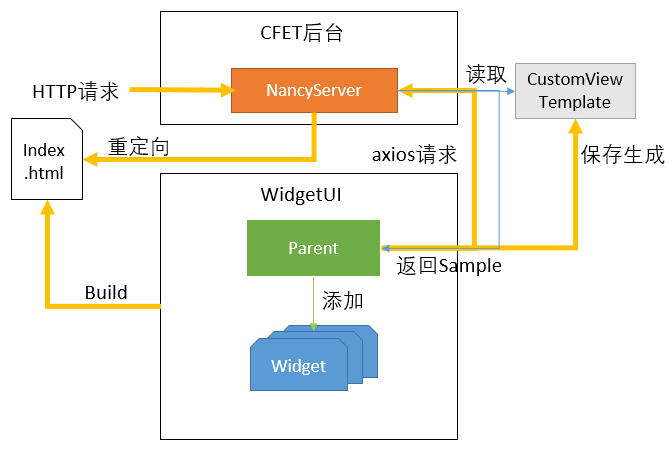
## Widget
widget是WidgetUI的显示控件，是CFET中的resource在网页界面的一种显示形式。每个WidgetUI界面是数个Widget加导航栏的组成。
### Widget Base
每个Widge都有共同的性质，这些性质被描述在Widget基类中，被每个Widget继承。
这些性质具体如下：

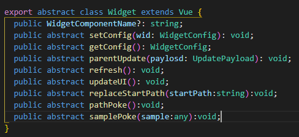
1. 每个Widget的类型名称
> WidgetComponentName。目前的类型按功能逻辑分类主要有Status，Method，Config，Thing，WaveView。按照显示样式的不同有State。之后根据需求还会陆续添加。
2. 保存和加载自身配置
> getConfig：每个widget需要将自身的内容以给定的格式保存起来提供给Parent。
setConfig：根据Parent提供的数据填充自己的路径和输入框中的值，同时更新界面。
给定格式：

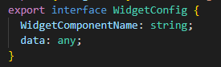
3. 刷新自身界面
> 根据当前的URL生成对应输入框等显示。
4. 刷新自身值
> 根据当前URL和输入框变量值向后台通过axios发出请求，根据返回值刷新显示值。
5. 根据给定路径自动填充返回完整路径
> 路径的来源有两种。一个是Parent向widget提供sample，根据sample中的参数信息将变量补充在URL后。二是根据用户在输入框中输入的URL去向后台请求sample，从而对URL进行填充。

### Widget Type
1. 

## Parent
Parent是对所有widget进行管理的部分，是所有widget的父组件。
主要功能分为两部分，一是对Widget的管理，二是支持根据当前URL生成对应widget或者customview。

### 对Widget的管理
1. 添加并显示各widget
> 将选中widget添加进一个List，同时为它分配一个唯一的ref。后期对Widget Component的调用都将通过ref。

2. 对widget进行拖拽放缩
> 这个功能引用了vue-grid-layout，将每个widget包含在一个GridItem里，便可对每个widget进行拖拽放缩

3. 保存以及加载configfile
> 调用List中各widget的保存加载配置文件的方法。并将它们对应的ref也保存下来以及拖拽功能所需要的坐标信息存下来。
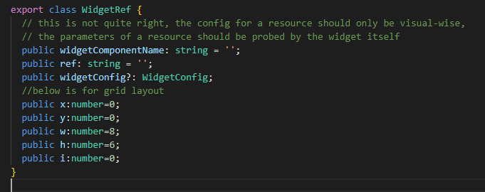

### 根据fragment生成对应界面
具体流程图：
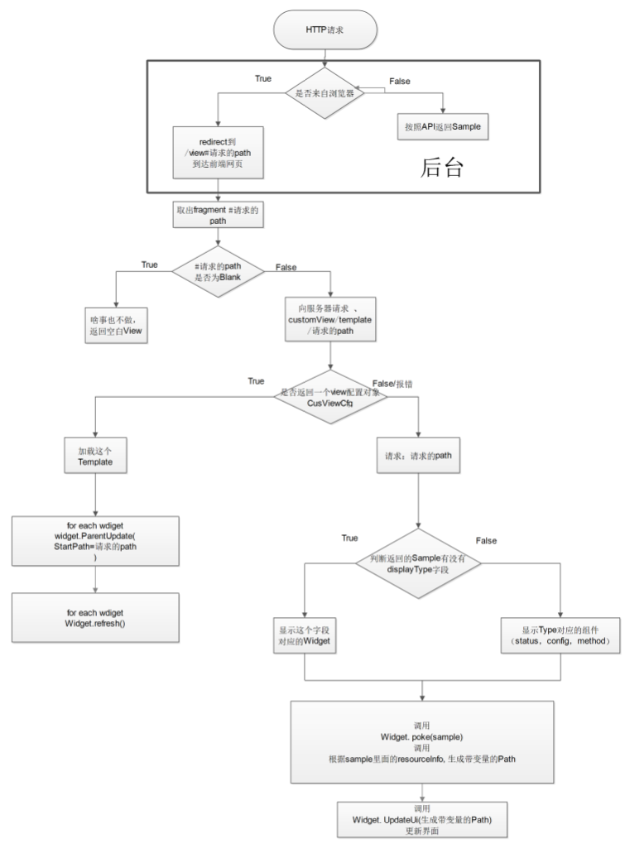

# WidgetUI使用说明
1. 初始界面
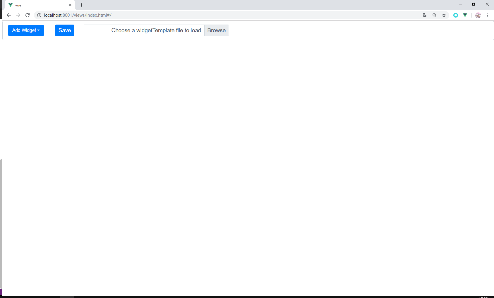
2. 添加Widget
> 点击Add Widget添加Widget

3. Widget使用，以Config为例
> 按住蓝边可以进行拖动，按住右下角直角符号可以进行放缩

> 点击右上角设置按钮出现Path输入框

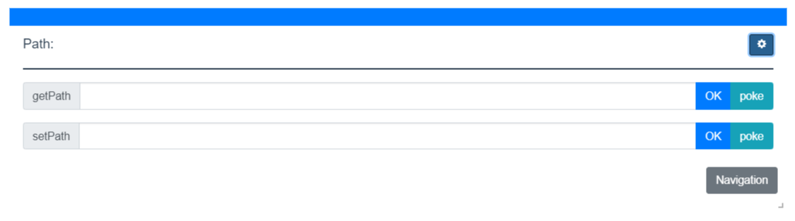
> 输入路径，想要显示的参数名用$$括起来

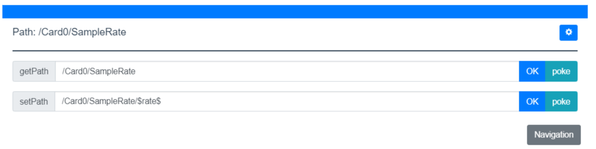
> 点击OK生成对应输入框，同时路径输入框会被隐藏，想要显示再次点击右上设置按钮即可。

> 当不确定参数信息时，输入路径后点击Poke

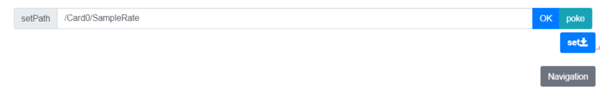

> 会将该属性所需要的所有参数显示出来

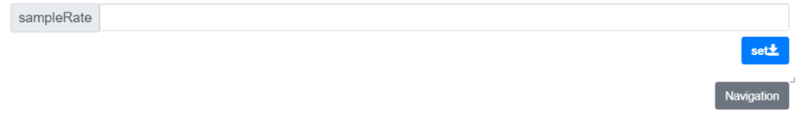

> 想要获取或设置值时，在输入框中输入参数值，点击下箭头按钮

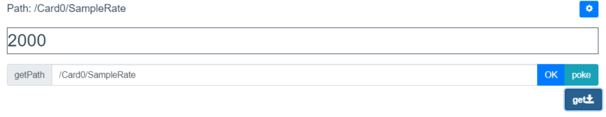

> Navigation会显示其父子属性链接，点击后即可跳转

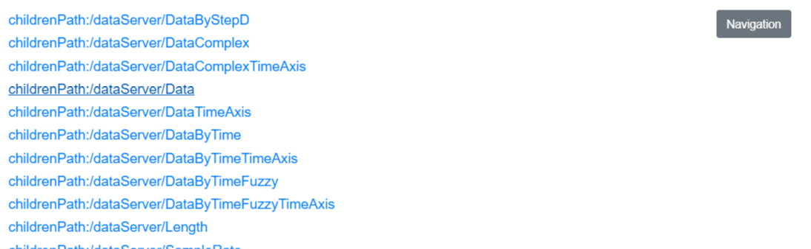

4. 设好各信息后，点击save按钮将当前界面保存下来。
5. 加载保存界面时，点击Browse按钮选择文件加载。
6. 在浏览器栏直接输入属性路径也可以访问对应界面。
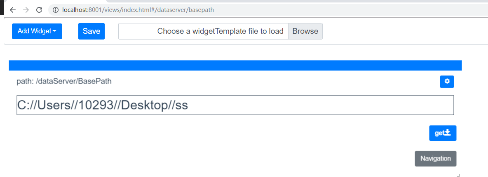